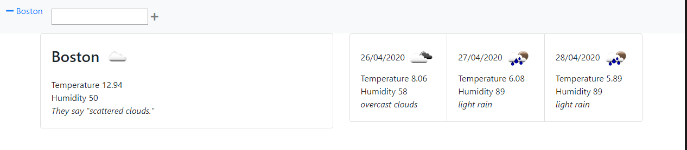

# 06 Server-Side APIs: Weather Dashboard

[06 Server-Side APIs: Weather Dashboard](https://timansy.github.io/06_homework/docs/06/index.html)

## Object

My goal was to make a weather application weather application Evelyn could use.

To do this, I would display weather in metric form and use European date styling. 

## User Story

```
AS A traveler
I WANT to see the weather outlook for multiple cities
SO THAT I can plan a trip accordingly
```

## Acceptance Criteria - I modifidied a few for simplicity.

```
GIVEN a weather dashboard with form inputs
WHEN I search for a city
THEN I am presented with current and future conditions for that city and that city is added to the search history
WHEN I view current weather conditions for that city
THEN I am presented with the city name, the date, an icon representation of weather conditions, the temperature, the humidity, the wind speed, and the UV index

WHEN I view future weather conditions for that city
THEN I am presented with a 3-day forecast that displays the date, an icon representation of weather conditions, the temperature, and the humidity
WHEN I click on a city in the search history
THEN I am again presented with current and future conditions for that city
WHEN I open the weather dashboard
THEN I am presented with the last searched city forecast
```

The following image demonstrates the application functionality:



